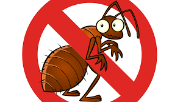
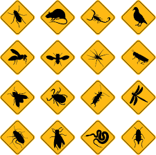

## Services Offered
<head>
<link href="/css/bootstrap.min.css" rel="stylesheet">
		<link href="/style.css" rel="stylesheet" type="text/css"> 
		
		
		<link rel="stylesheet" type="text/css" href="/css/dataTables.bootstrap.min.css">
		<link rel="stylesheet" type="text/css" href="/css/datepicker.css">
		
		
		
		

</head>
<body>

		

			

				

					<b>Intro to services</b> 
					  
					  
				

			

			       
			<table class="table custom">
				<thead class="blue-grey lighten-4 customtableheader">
					<tr>  
					   <th>Service</th> 
					   <th>Service Code</th> 
					   <th>Description</th> 
					   <th>Cost</th> 
					   <th></th> 
				  </tr>
				</thead>
				<tbody>
                <tr> 
						<td>Service details</td> 
						<td>Code details</td> 
						<td>Descr details</td> 
						<td>Cost details</td> 
						<td>Other details</td> 
                </tr>
				</tbody>
			</table>
			
		

	

<form name="myForm" action="/action_page.php"
onsubmit="return validateForm()" method="post">
Name: <input type="text" name="fname">
<input type="submit" value="Submit">
    
    
Below is link to home

<a href="/AO-Pest-Control/">Back to Home</a> 
</form>
