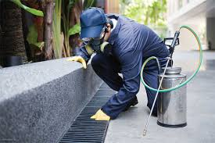

<head>
<link href="/css/bootstrap.min.css" rel="stylesheet">
		<link href="/style.css" rel="stylesheet" type="text/css"> 
		
		
		<link rel="stylesheet" type="text/css" href="/css/dataTables.bootstrap.min.css">
		<link rel="stylesheet" type="text/css" href="/css/datepicker.css">
		
		
		
		
<h2>Home</h2>

<body>
<nav class="navbar navbar-default">
  

    <ul class="nav navbar-nav">
      <li class="active"><a href="readme2">Home</a></li>
      <li><a href="About">About</a></li>
      <li><a href="services">Services</a></li>
      <li><a href="ContactUs">Contact</a></li>
    </ul>
  

</nav>

   
			       
			<table class="table custom">
				
				<tbody>
            <tr> 
						<td valign="center"></td> 
						<td>Wasps are known to sting even when they are not provoked. A sting can be extremely painful especially when you have an allergic reaction. Wasp nest removal is therefore required when you notice a level of activity of wasps in and around your property in order to reduce the risk of being stung.</td> 
						<td valign="center"></td> </tr>
						
                <tr><td>When dealing with wasp nest removal it is vital you do not attempt this yourself. Wasp nest removal can be extremely dangerous, multiple stings can lead to a hospital visit and in rare cases where wasps have stung inside the mouth or other sensitive areas even death.</td>
                <td valign="center"></td><td>When dealing with wasp nest removal it is vital you do not attempt this yourself. Wasp nest removal can be extremely dangerous, multiple stings can lead to a hospital visit and in rare cases where wasps have stung inside the mouth or other sensitive areas even death.</td> </tr>
                
				</tbody>
			</table>
			
		
	

  

<a href="/AO-Pest-Control/">Back to Home</a> 
<a href="About">About</a> 
<a href="services">Services</a> 
<a href="ContactUs">Contact Us</a> 
